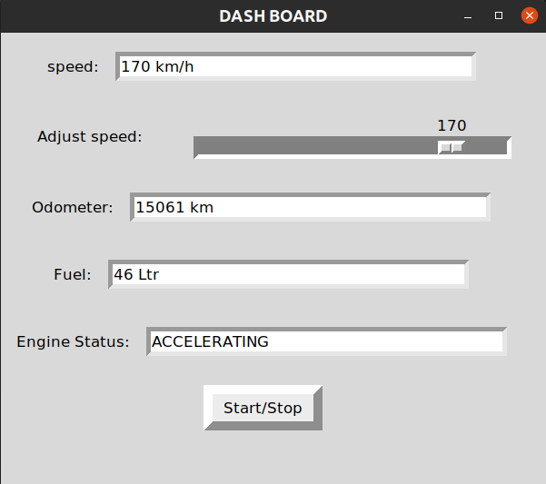

# Car-Dashboard-Simulation
Simulate a car dashboard in C and display the data using tkinter GUI in python.The communication between the scripts is carried out with IPC with sockets


# Tkinter


Tkinter is the standard GUI library for Python. Python when combined with Tkinter provides a fast and easy way to create GUI applications.

## Installation

Probably pre-installed.

Use the package manager [pip](https://pip.pypa.io/en/stable/) to install Tkinter.

```bash
pip install tk
```


## Usage

```python
import tkinter

# create a window'
 window = tk.Tk()

# Run the GUI
window.mainloop()
```


## Socket


Socket is a Python library that define how server and client machines can communicate at hardware level using socket endpoints on top of the operating system

## Installation

Use the package manager [pip](https://pip.pypa.io/en/stable/) to install socket.

```bash
pip install socket
```

## Usage

```python
import socket

    # Create a socket object
    client_socket = socket.socket(socket.AF_INET, socket.SOCK_STREAM)

    # Get local machine name
    host = socket.gethostname()

    # Connect to the server
    client_socket.connect((host, port))
```

# Struct


The module struct is used to convert the native data types of Python into string of bytes and vice versa.

## Installation

Probably pre-installed.

Use the package manager [pip](https://pip.pypa.io/en/stable/) to install struct.

```bash
pip install supyr-struct
```


## Usage

```python
import struct

#Receive 12 bytes of data from socket
data = socket.recv(12)  # Receive 3 integers

# Unpack the data as 3 integers,and assign it to 3 variables
V1, V2, V3 = struct.unpack("iii", data)
```

## Contributing

Pull requests are welcome. For major changes, please open an issue first
to discuss what you would like to change.

Please make sure to update tests as appropriate.

## License

[GNU General Public License 2.0](https://choosealicense.com/licenses/mit/)

## Usage

### From terminal 1
```bash
./TEST
```

Enter the port number in the command line prompt

### From terminal 2

```bash
python3 GUI.py -p <port number>
```
#### Preview of GUI



In the GUI,update the slider to update vehicle speed